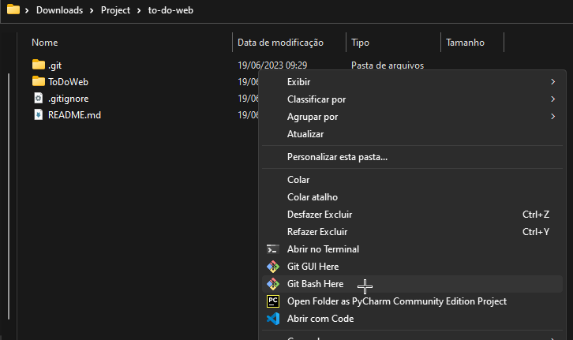
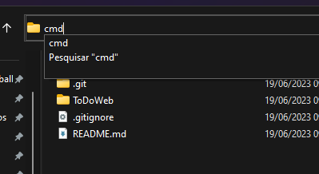
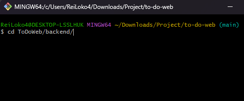
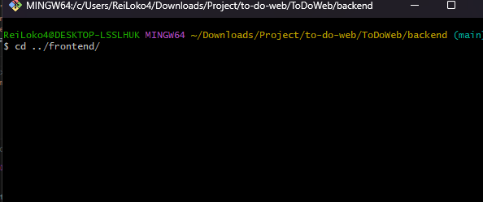
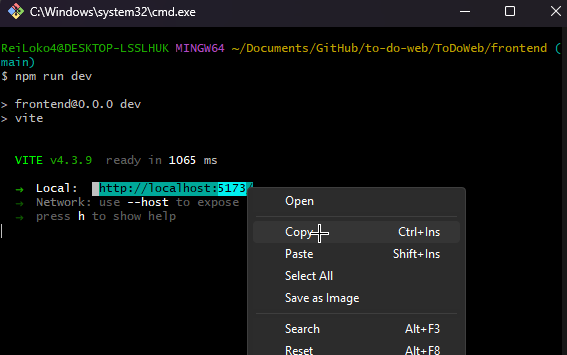

# to-do-web 🇧🇷
<br>

# Resumo
<h3>Um site usando o framework React e uma API em Typescript que tem como foco armazenar, mostrar, editar e excluir listas de afazeres usando o banco de dados não-relacional (NotSQL) MongoDB e NodeJS como biblioteca e compilador.</h3><br>

# Sumário
* [Resumo](#resumo)
* [Tecnologias](#tecnologias-utlizadas)
* [Requisitos](#Requisitos)
* [Instruções de uso](#instruções-de-uso)
* [Teste de Token CSRF](#teste-de-token-csrf)<br><br>

# Tecnologias utlizadas
- [Typescript](https://www.typescriptlang.org/)
- [MongoDB](https://www.mongodb.com/)
- [NodeJS](https://nodejs.org/en/download) 
- [Express](https://expressjs.com/pt-br/)
- [React](https://react.dev/)
- [Vite](https://vitejs.dev/)<br><br>

# Requisitos

- [NodeJS](https://nodejs.org/en/download)<br><br>

# Instruções de uso

1. Certifique se de ter o NodeJS instalado em seu computador antes de continuar

2. Abra o terminal de sua prefêrencia na pasta raiz do projeto, recomendo o [Git Bash](https://git-scm.com/downloads)<br>
<br><br>
<br> <br><br>

3. Se dirija a pasta 'backend' atráves do comando 'cd' [(guia de uso aqui)](https://learn.microsoft.com/pt-br/windows-server/administration/windows-commands/cd)<br>
<br>

4. Digite o seguinte comando no terminal e pressione enter:
    ```
    npm install
    ```

5. Aguarde o processo de instalação de bibliotecas terminar, após isso rode o comando:
    ```
    npm run start
    ```
6. Abra outro terminal conforme o passo 2

7. Se dirija a pasta 'frontend' usando o comando 'cd' novamente<br>
<br><br>
8. Digite o seguinte comando e pressione enter:
    ```
    npm install
    ```

9. Aguarde a instalação das bibliotecas, após isso rode o comando:
    ```
    npm run dev
    ```

10. Copie o link mostrado no terminal
<br><br>

11. Abra um navegador de sua prefêrencia e cole o link
<br><br>

* ⚠️ OBS: os terminais devem estar rodando o comando ao mesmo tempo, do contrário resultará em erro.<br><br>

# Teste de Token CSRF

